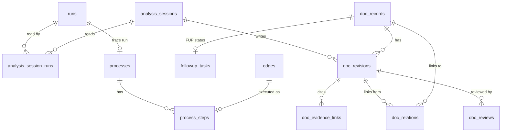
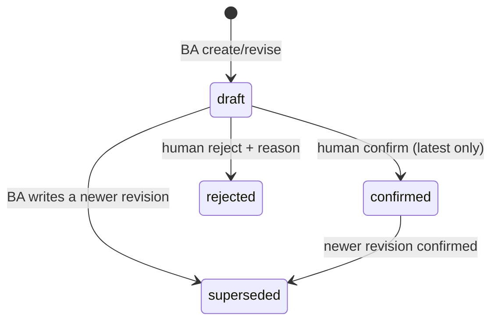

# Phase 1 Data Model: BA Documentation

Adds Layer B (the BA deliverable) and trace-mode process records on top of the Layer A tables from
specs 001/002. Conventions from `data/schema/README.md` and the `sqlite-conventions` skill apply
unchanged: STRICT tables, server UUIDv7 `id`s, UTC ISO timestamps with ms, JSON as `TEXT` with
`CHECK (json_valid(...))`, enums as CHECKs, booleans as INTEGER 0/1. Zod schemas in
`@pathfinder/core/schemas` are the write contract; the dashboard's Pydantic read models mirror the
tables and are drift-tested (003 FR-015).

Two migrations, owned by `db-admin`:

- `0004_ba_documentation` (R-13): sessions, records, revisions, evidence links, relations,
  reviews, follow-up tasks.
- `0005_trace_processes` (R-14): processes, process steps.

## Analysis Session — `analysis_sessions`

| Column | Type | Notes |
|---|---|---|
| `id` | TEXT PK | UUIDv7 |
| `portal_id` | TEXT NOT NULL | |
| `status` | TEXT NOT NULL | `running`, `completed`, `interrupted` |
| `passes_json` | TEXT NOT NULL | JSON array of `{pass, summary, completed_at}`; pass ∈ `inventory, capabilities, processes, rules, data, nfr, synthesis` |
| `summary` | TEXT | Required when `completed` (CHECK) |
| `gaps_json` | TEXT NOT NULL DEFAULT `'[]'` | JSON array of strings: what was not observable / skipped |
| `started_at`, `ended_at` | TEXT | `ended_at` NULL while running |

Resume: `start_session(resume_session_id)` on an `interrupted` session sets it back to `running`.
A `running` session with no write for 24 h is swept to `interrupted` on server start (same pattern as
`interruptStaleRuns`).

## Session input runs — `analysis_session_runs`

| Column | Type | Notes |
|---|---|---|
| `session_id` | TEXT FK → analysis_sessions | |
| `run_id` | TEXT FK → runs | Must belong to the session's portal (tool check) |
| PK | (`session_id`, `run_id`) | `WITHOUT ROWID` |

## Documentation Record — `doc_records`

| Column | Type | Notes |
|---|---|---|
| `id` | TEXT PK | UUIDv7 |
| `portal_id` | TEXT NOT NULL | |
| `kind` | TEXT NOT NULL | CHECK: `capability, screen, process, use_case, requirement, nfr, business_rule, glossary_term, data_item, assumption, open_question, followup` |
| `key` | TEXT NOT NULL | `<PREFIX>-<seq 3+ digits>`; UNIQUE(`portal_id`, `key`) |
| `seq` | INTEGER NOT NULL | per (portal, kind); UNIQUE(`portal_id`, `kind`, `seq`) |
| `title` | TEXT NOT NULL | Copied from the latest revision's content for listing |
| `latest_rev` | INTEGER NOT NULL | Number of the latest revision |
| `confirmed_rev` | INTEGER | Latest confirmed revision number, NULL if none |
| `withdrawn` | INTEGER NOT NULL DEFAULT 0 | 0/1; set when the latest revision's `change = 'withdraw'` |
| `created_at`, `updated_at` | TEXT NOT NULL | |

Key prefixes: `CAP` capability, `SCR` screen, `PROC` process, `UC` use case, `REQ` requirement,
`NFR`, `BR` business rule, `GL` glossary term, `DI` data item, `ASM` assumption, `OQ` open question,
`FUP` follow-up. `latest_rev`, `confirmed_rev`, `title`, `withdrawn` are denormalised by the status
engine in the same transaction as the revision/review write (fast listing; checked by `docs:audit`).

## Revision — `doc_revisions`

| Column | Type | Notes |
|---|---|---|
| `id` | TEXT PK | UUIDv7 |
| `record_id` | TEXT FK → doc_records | |
| `rev_no` | INTEGER NOT NULL | 1..n; UNIQUE(`record_id`, `rev_no`) |
| `session_id` | TEXT FK → analysis_sessions | Session that wrote it |
| `change` | TEXT NOT NULL | `create`, `revise`, `withdraw` |
| `content_json` | TEXT NOT NULL | Kind-specific, validated by Zod (below) |
| `confidence` | TEXT NOT NULL | `observed, inferred, needs_confirmation` |
| `not_observable` | INTEGER NOT NULL DEFAULT 0 | 0/1; when 1 an `open_question` link or relation is required (tool check) |
| `status` | TEXT NOT NULL | `draft, confirmed, rejected, superseded`; changed only by the status engine |
| `change_note` | TEXT | Required for `revise`/`withdraw` (CHECK): what changed and why; cites a review id when responding to one |
| `responds_to_review` | TEXT FK → doc_reviews | Optional |
| `created_at` | TEXT NOT NULL | |

Immutable except `status`. Status transitions: [research §4](research.md#4-stable-ids-and-revisions).

### Content per kind (Zod discriminated union on `kind`)

All kinds: `title` (English), `summary?`. Portal-language strings are stored in `verbatim` fields
as shown in the portal with a `lang` code (D6).

| Kind | Required content fields |
|---|---|
| `capability` | `description` |
| `screen` | `purpose`, `route_templates[]`, `elements[]` (`{role, label_verbatim}`), `entry_points[]` |
| `process` | `goal`, `persona`, `trigger`, `outcome`, `observed_extent` (`full` \| `until_boundary` \| `map_only`) |
| `use_case` | `primary_actor`, `preconditions[]`, `trigger`, `main_flow[]` (`{n, actor_or_system, text}`), `alternate_flows[]`, `exception_flows[]`, `postconditions[]` |
| `requirement` | `statement` ("The system shall …"), `rationale?` (+ `rationale_confidence`), `acceptance_criteria[]` (`{given[], when[], then[]}`), `priority` (`must, should, could, wont, unset`) |
| `nfr` | `category` (`performance, security, accessibility, availability, compliance, usability, localisation`), `statement`, `measured?` (`{value, unit, how}`) |
| `business_rule` | `statement`, `rule_type` (`constraint, computation, inference, action_enabler`), `decision_table?` (`{conditions[], actions[], rows[]}`) |
| `glossary_term` | `term_verbatim`, `lang`, `definition` (English), `synonyms_verbatim[]` |
| `data_item` | `name_verbatim`, `lang`, `name_en`, `data_type`, `constraints` (`required?, format?, min_length?, max_length?, allowed_values[]?, pattern_observed?`), `seen_in[]` (`form`/`network_call`) |
| `assumption` | `statement`, `impact_if_wrong` |
| `open_question` | `question`, `why_it_matters`, `answer_needed_from` (`sme, crawler, either`) |
| `followup` | `question`, `suggested_mode` (`map, trace`), `target` (`{url?} \| {process_name, goal}`), `persona`, `reason` |

## Evidence Link — `doc_evidence_links`

| Column | Type | Notes |
|---|---|---|
| `id` | TEXT PK | |
| `revision_id` | TEXT FK → doc_revisions | |
| `target_kind` | TEXT NOT NULL | `state, edge, action, form, network_call, rule_candidate, open_question, decision, process, process_step, doc_record, review` |
| `target_id` | TEXT NOT NULL | Polymorphic, resolved by the tool; no FK |
| `run_id` | TEXT FK → runs | The run the evidence came from; NULL only for `doc_record`, `review` (CHECK) |
| `note` | TEXT | What in the target supports the claim (e.g. "field `Kod pocztowy` marked required") |

Index `(run_id)` for run → records reverse lookups (FR-033); index `(target_kind, target_id)`.
Every revision has ≥ 1 link (enforced by the tool in the same transaction and by `docs:audit`).

## Relation — `doc_relations`

| Column | Type | Notes |
|---|---|---|
| `from_revision_id` | TEXT FK → doc_revisions | Relations are versioned with the revision that asserts them |
| `to_record_id` | TEXT FK → doc_records | Points at a record (its current revision at read time) |
| `type` | TEXT NOT NULL | `contains, describes, refines, enforces, appears_on, uses_term, synonym_of, answers, depends_on` (process steps and personas are not records: steps live in `process_steps`, the persona in `process` content) |
| PK | (`from_revision_id`, `to_record_id`, `type`) | |

Allowed (from kind, type, to kind) triples are a table in `@pathfinder/docs` (tasks.md T009).

## Review — `doc_reviews`

| Column | Type | Notes |
|---|---|---|
| `id` | TEXT PK | |
| `revision_id` | TEXT FK → doc_revisions | |
| `action` | TEXT NOT NULL | `confirm, reject, comment` |
| `reviewer` | TEXT NOT NULL | From dashboard setting `PATHFINDER_REVIEWER` or CLI `--reviewer` |
| `text` | TEXT | Required for `reject` and `comment` (CHECK) |
| `created_at` | TEXT NOT NULL | |

Written only by `docs:review`. The BA reads reviews newer than its last session through
`get_pending_feedback`.

## Follow-up task status — `followup_tasks`

| Column | Type | Notes |
|---|---|---|
| `record_id` | TEXT PK FK → doc_records | kind must be `followup` |
| `status` | TEXT NOT NULL | `open, in_progress, done, blocked, cancelled` |
| `run_id` | TEXT FK → runs | Set when a run starts for it |
| `blocked_reason` | TEXT | Required when `blocked` (CHECK) |
| `updated_at` | TEXT NOT NULL | |

Transitions by deterministic code only: [research §11](research.md#11-follow-up-tasks-lifecycle).

## Process — `processes` (0005, written by the crawler server)

| Column | Type | Notes |
|---|---|---|
| `id` | TEXT PK | |
| `run_id` | TEXT NOT NULL UNIQUE FK → runs | One process per trace run |
| `portal_id`, `persona_id` | TEXT NOT NULL | |
| `name`, `goal` | TEXT NOT NULL | From `start_run` |
| `followup_record_id` | TEXT FK → doc_records | Optional |
| `status` | TEXT NOT NULL | `recorded` only (CHECK allows later `replay_verified, documented` for QA work) — crawler writes `recorded` |
| `outcome` | TEXT | `goal_reached, boundary_reached, stopped, abandoned`; NULL while running |
| `boundary_action_id` | TEXT FK → actions | Required when `boundary_reached` (CHECK) |
| `observed_result` | TEXT | Agent-supplied at finish; facts only |
| `not_observable` | TEXT | Required when `boundary_reached` (CHECK): what could not be observed |
| `created_at`, `ended_at` | TEXT | |

## Process Step — `process_steps` (0005)

| Column | Type | Notes |
|---|---|---|
| `id` | TEXT PK | |
| `process_id` | TEXT FK → processes | |
| `ord` | INTEGER NOT NULL | 1..n; UNIQUE(`process_id`, `ord`) |
| `intent` | TEXT NOT NULL | Agent-supplied, e.g. "Open the car insurance calculator" |
| `kind` | TEXT NOT NULL | `navigate, click, fill, check, select` |
| `action_id` | TEXT FK → actions | NULL for `navigate` |
| `edge_id` | TEXT FK → edges | Network calls reach the step via `network_calls.edge_id` |
| `value` | TEXT | Scrubbed synthetic input for `fill/select`; NULL otherwise |
| `state_before`, `state_after` | TEXT FK → states | `state_after` NULL if nothing changed/settled |
| `outcomes_json` | TEXT NOT NULL | JSON array of observed outcome strings derived by the server |
| `evidence_ref` | TEXT NOT NULL | ARIA snapshot after the step |
| `confidence` | TEXT NOT NULL | `observed` (server-observed); CHECK allows the enum |
| `created_at` | TEXT NOT NULL | |

## Run mode

`RunMode` Zod enum becomes `['map', 'trace']`. No migration (`runs.mode` has no CHECK by design).

## Portal data partition (spec 002 FR-028)

`portal:export` and `portal:delete` add, in delete order: `doc_reviews`, `doc_relations`,
`doc_evidence_links`, `followup_tasks`, `doc_revisions`, `doc_records`, `analysis_session_runs`,
`analysis_sessions` (by `portal_id`); `process_steps`, `processes` before `runs`.

## Validation rules (cross-cutting)

- No revision without ≥ 1 evidence link (FR-004, SC-001).
- `observed` requires an observed Layer A target (FR-006, research §5).
- Evidence targets must belong to the record's portal and, for run-bound targets, to a run listed
  in the writing session (`RUN_NOT_IN_SESSION`).
- `not_observable = 1` requires an `open_question` record relation (`answers` inverse) or a crawler
  `open_question` evidence link.
- Status only changes through the status engine; no tool/CLI input carries a status.
- Prose in English; `*_verbatim` fields hold portal-language text (D6). Not machine-checked; the
  `ba-practice` skill states the rule and reviewers reject violations.
